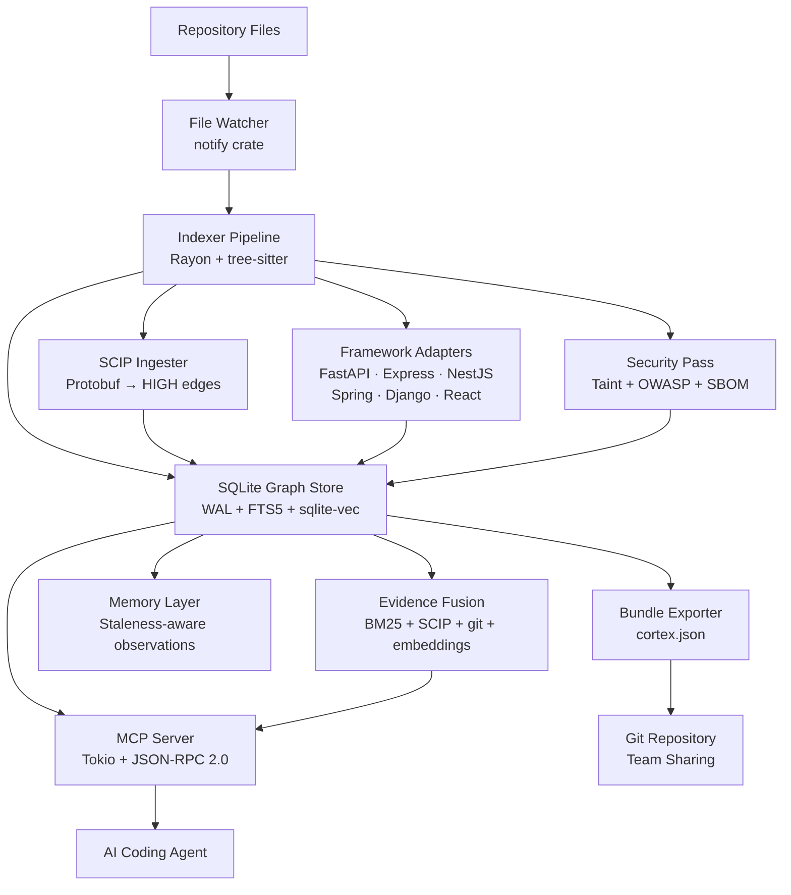

# Cortex

[](https://github.com/1337Xcode/cortex/releases)
[](https://github.com/1337Xcode/cortex/actions)
[](LICENSE)
[](https://www.rust-lang.org/)
[](docs/tools.md)
[](docs/architecture.md)
[]()
[](https://www.npmjs.com/package/@1337xcode/cortex)
[](https://1337xcode.github.io/cortex)

One binary. Zero dependencies. 29 languages. 32 MCP tools. Local code intelligence for AI coding agents.

**[Documentation](https://1337xcode.github.io/cortex)** · **[npm](https://www.npmjs.com/package/@1337xcode/cortex)** · **[Issues](https://github.com/1337Xcode/cortex/issues)**

## Works with

<p>
  &nbsp;&nbsp;
  &nbsp;&nbsp;
  &nbsp;&nbsp;
  &nbsp;&nbsp;
  &nbsp;&nbsp;
  &nbsp;&nbsp;
  &nbsp;&nbsp;
  &nbsp;&nbsp;
  &nbsp;&nbsp;
  
</p>

Any MCP-compatible AI agent, IDE, or CLI tool connects out of the box. `cortex install` auto-detects your setup and writes the config.

<details>
<summary>All 25 supported platforms</summary>

| Platform | Install command |
|---|---|
| Claude Code (Linux/Mac) | `cortex install` |
| Claude Code (Windows) | `cortex install --platform claude-code` |
| Codex | `cortex install --platform codex` |
| OpenCode | `cortex install --platform opencode` |
| GitHub Copilot CLI | `cortex install --platform copilot` |
| VS Code Copilot Chat | `cortex vscode install` |
| Aider | `cortex install --platform aider` |
| OpenClaw | `cortex install --platform openclaw` |
| Factory Droid | `cortex install --platform droid` |
| Trae | `cortex install --platform trae` |
| Trae CN | `cortex install --platform trae-cn` |
| Gemini CLI | `cortex install --platform gemini` |
| Hermes | `cortex install --platform hermes` |
| Kimi Code | `cortex install --platform kimi` |
| Kiro IDE/CLI | `cortex kiro install` |
| Pi coding agent | `cortex install --platform pi` |
| Cursor | `cortex cursor install` |
| Google Antigravity | `cortex antigravity install` |
| Windsurf | `cortex install --platform windsurf` |
| Zed | `cortex install --platform zed` |
| JetBrains | `cortex install --platform jetbrains` |
| Cline/Roo | `cortex install --platform cline` |
| Continue.dev | `cortex install --platform continue` |
| Supermaven | `cortex install --platform supermaven` |
| Tabnine | `cortex install --platform tabnine` |

</details>

## Why Cortex

An agent asking "what calls processOrder" gets a 200-token graph result instead of burning 20,000 tokens reading files. That's 100x fewer tokens on a single structural question.

Cortex indexes your repository into a SQLite call graph and exposes it over the Model Context Protocol. 127 files indexed in 535ms. Incremental re-index in 13ms. Handles 100K to 1M+ line repositories.

**v1.1 adds multi-source confidence-aware intelligence.** Cortex now ingests SCIP indexes for precise symbol resolution, runs framework-specific adapters (FastAPI, Express, NestJS, Spring, Django, React) to detect dependency injection and routing wiring, tags every edge with a confidence tier, and falls back honestly when it can't give a confident answer. The `ask` and `get_task_context` tools are completely overhauled with evidence-fusion ranking and structured fallback suggestions.

## Install

```sh
npx @1337xcode/cortex@latest install
```

<details>
<summary>Other methods</summary>

**Shell script**

```sh
curl -fsSL https://raw.githubusercontent.com/1337Xcode/cortex/main/install.sh | sh
```

**Build from source**

```sh
git clone https://github.com/1337Xcode/cortex.git && cd cortex
cargo build --release
cp target/release/cortex ~/.local/bin/
```

</details>

## Quick start

```sh
cortex index    # parse your repo, build the graph
cortex install  # detect Claude Code / Cursor, write MCP config
cortex serve    # start the MCP server
```

Your agent queries the graph instead of reading raw files.

## Demo commands

```sh
cortex impact UserService.getUser       # blast radius: what breaks if I change this?
cortex explain DatabasePool.acquire     # offline function explanation, zero LLM calls
cortex security report                  # taint flows, OWASP patterns, dependency vulns
cortex diff main feature-branch         # call graph diff between branches
cortex viz --export graph.html          # interactive 3D graph in a standalone HTML file
cortex ci --fail-on-taint               # CI quality gate with exit codes
cortex hotspots --months 6              # high-churn risky code ranked by risk score
cortex coverage --lcov coverage.lcov    # populate coverage field, rank untested functions
cortex modules                          # Leiden community detection module boundaries
cortex federate add ../auth-service     # query across repos with unified graph
cortex benchmark                        # run correctness suite, report pass rate + token savings
cortex status --savings                 # token savings dashboard with honest net-negative reporting
cortex index --repair                   # rebuild index from scratch, preserve observations
cortex semantic enable                  # build embedding index for semantic search
```

## What you get

- **29 languages** parsed via tree-sitter
- **32 MCP tools** exposed over stdio, or 5 in smart mode (the `ask` meta-tool routes internally)
- **SCIP index ingestion** for precise symbol resolution — SCIP edges win over tree-sitter on conflicts
- **6 framework adapters** (FastAPI, Express, NestJS, Spring, Django, React) detect DI wiring, middleware chains, and routing that tree-sitter cannot see
- **Confidence-tagged edges** — every edge carries `edge_source` and `confidence` (1.0 SCIP / 0.8 framework / 0.5 AST / 0.3 name-match); queries default to confidence ≥ 0.7
- **Evidence-fusion `get_task_context`** — multi-signal ranking (BM25 + SCIP distance + git recency + edge confidence + file size penalty) with per-file reasons and guaranteed non-empty results
- **Honest fallback** — `ask` returns structured grep suggestions when confidence is below MEDIUM; never returns confidently wrong data from an unhealthy index
- **Index health gate** — all tools return a structured error with fallback suggestions when the index is empty or corrupt
- **Token savings dashboard** — `cortex status --savings` shows cumulative net saved, average per query, and net-negative queries (reported honestly)
- **`get_repo_brief`** — zero-parameter cold-start summary under 400 tokens: languages, frameworks, entry points, hotspots, security patterns, test shape
- **Tool surface management** — 10 default tools, 7 experimental (opt-in), 5 smart-tools mode; `semantic_search` only listed when embeddings are built
- **Incremental embeddings** — only re-embeds functions whose content hash changed; `cortex semantic enable` builds the initial index
- **Correctness benchmarks** — `cortex benchmark` validates tool accuracy against ground-truth; CI gate fails the build if pass rate drops below 70%
- **Sub-second incremental re-indexing** via native OS file watcher (inotify, FSEvents, ReadDirectoryChangesW)
- **Configurable model pricing** via `~/.cortex/pricing.toml` with longest-prefix matching
- **Taint flow analysis, OWASP Top 10 detection, SBOM generation** all running locally, no cloud
- **Cross-session memory** that marks observations stale when linked code changes
- **Multi-repo federation** for querying across repositories with a unified graph
- **CI quality gates** with configurable thresholds and exit codes
- **3D interactive graph visualization** exportable to standalone HTML
- **Portable JSON bundle** (cortex.json) for team sharing via git
- **Works offline.** No cloud, no API keys, no Docker, no language runtimes.

<details>
<summary>All 29 supported languages</summary>

| Language | Language | Language |
|----------|----------|----------|
| Python | TypeScript | JavaScript |
| Rust | Go | Java |
| C | C++ | C# |
| Ruby | PHP | Swift |
| Kotlin | Scala | Lua |
| Zig | Haskell | Elixir |
| Dart | R | Julia |
| OCaml | Bash | HCL/Terraform |
| Perl | Objective-C | SQL |
| YAML | TOML | |

</details>

## Architecture



## Confidence tiers

Every edge in the graph carries a source and confidence value. Queries default to confidence ≥ 0.7 (MEDIUM), filtering out heuristic name-match edges.

| Source | Confidence | How produced |
|--------|-----------|--------------|
| `scip` | 1.0 HIGH | SCIP index (precise symbol resolution) |
| `framework_adapter` | 0.8 MEDIUM | FastAPI/Express/NestJS/Spring/Django/React pattern matching |
| `ast_direct` | 0.5 LOW | tree-sitter AST extraction |
| `name_match` | 0.3 VERY_LOW | heuristic name-based resolution |

## Benchmark results

Cortex ships with a self-referential benchmark suite (`benchmark/cortex_self_benchmark.json`, 24 cases) covering `trace_callers`, `blast_radius`, `get_task_context`, and `ask`. Run it against your index:

```sh
cortex benchmark
```

The CI pipeline runs this on every release and fails the build if pass rate drops below 70%.

## Comparison

| Feature | Cortex | codebase-memory-mcp | Srclight | Serena | mcp-codebase-index |
|---------|--------|---------------------|----------|--------|-------------------|
| Architecture | Rust binary, SQLite | C binary, SQLite | Python, SQLite | Python, LSP | Python, SQLite |
| Languages | 29 (tree-sitter) | 66 (tree-sitter) | 10 (tree-sitter) | 40+ (LSP) | 4 |
| MCP tools | 32 (or 5 smart mode) | 14 | 42 | ~20 | 17 |
| Smart tool routing | Yes (ask meta-tool) | No | No | No | No |
| SCIP precise resolution | Yes | No | No | Yes (LSP) | No |
| Framework adapters | 6 (DI, routing, middleware) | No | No | No | No |
| Confidence-tagged edges | Yes (4 tiers) | No | No | No | No |
| Honest fallback | Yes (FallbackSuggestion) | No | No | No | No |
| Index health gate | Yes | No | No | No | No |
| Token savings dashboard | Yes (honest math) | No | No | No | No |
| Cold-start repo brief | Yes (get_repo_brief) | No | No | No | No |
| Correctness benchmarks | Yes (CI gate, 70% threshold) | No | No | No | No |
| Call graph | Function-level | Full chains | Callers/callees | LSP-precise | Cross-file |
| Hybrid search | FTS5 + sqlite-vec | Graph only | RRF fusion | Keyword | Structural |
| Token reduction | 100x on structural queries | 121x avg | Not measured | Not measured | 87% |
| Incremental update | 13ms (no changes) | Milliseconds | Git hooks | LSP live | Hash-based |
| Security (taint/OWASP/SBOM) | Yes | No | No | No | No |
| Cross-session memory | Staleness-aware | No | No | No | No |
| Multi-repo federation | Yes | No | SQLite ATTACH | Partial | No |
| Community detection | Leiden algorithm | No | Leiden | No | No |
| Coverage gap analysis | Yes (LCOV cross-ref) | No | No | No | No |
| Single binary, zero deps | Yes | Yes | No (Python) | No (Python+LSP) | No (Python) |
| Auto IDE config | 25 agents | No | No | No | No |
| Air-gap compatible | Yes | Yes | Yes | Yes | Yes |
| License | MIT | MIT | MIT | MIT | MIT |

## Documentation

- [Getting started](docs/getting-started.md)
- [IDE setup](docs/ide-setup.md)
- [CLI reference](docs/cli-reference.md)
- [MCP tools](docs/tools.md)
- [Configuration](docs/configuration.md)
- [Architecture](docs/architecture.md)

Full docs site: [1337xcode.github.io/cortex](https://1337xcode.github.io/cortex)

## License

[MIT](LICENSE)

**[Documentation](https://1337xcode.github.io/cortex)** · **[npm](https://www.npmjs.com/package/@1337xcode/cortex)** · **[Issues](https://github.com/1337Xcode/cortex/issues)**
