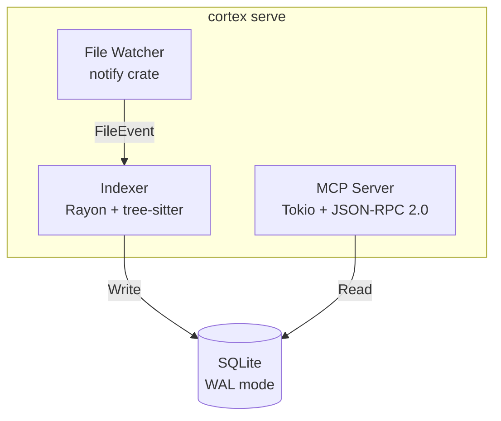
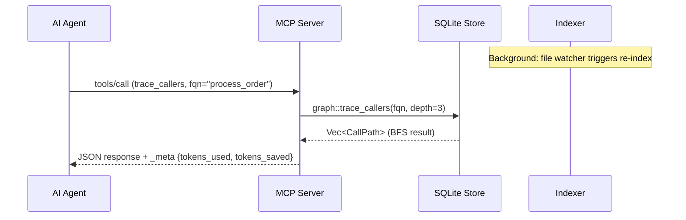
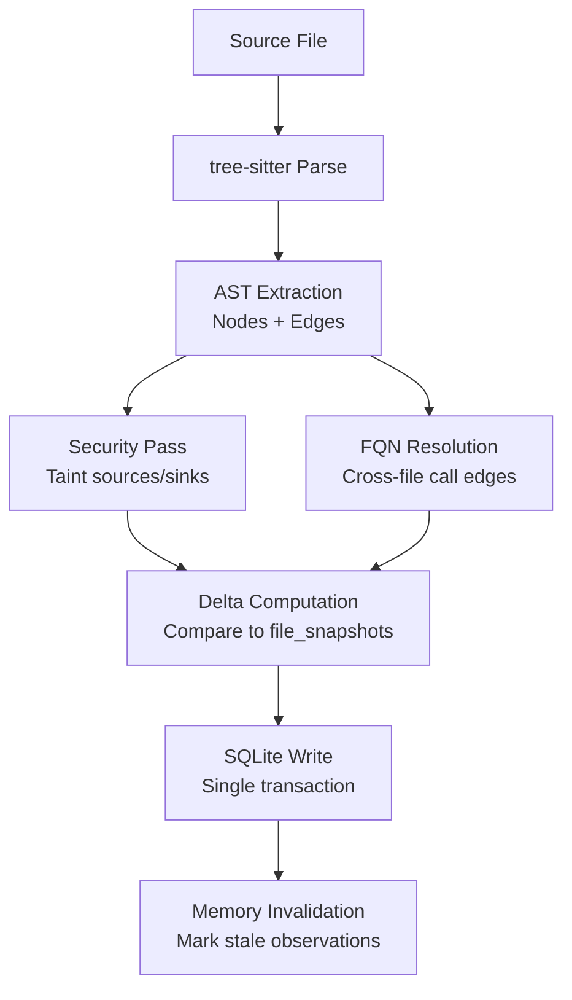
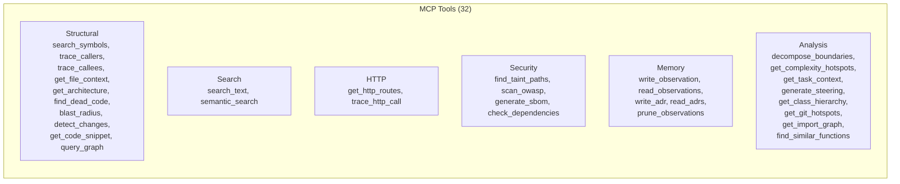
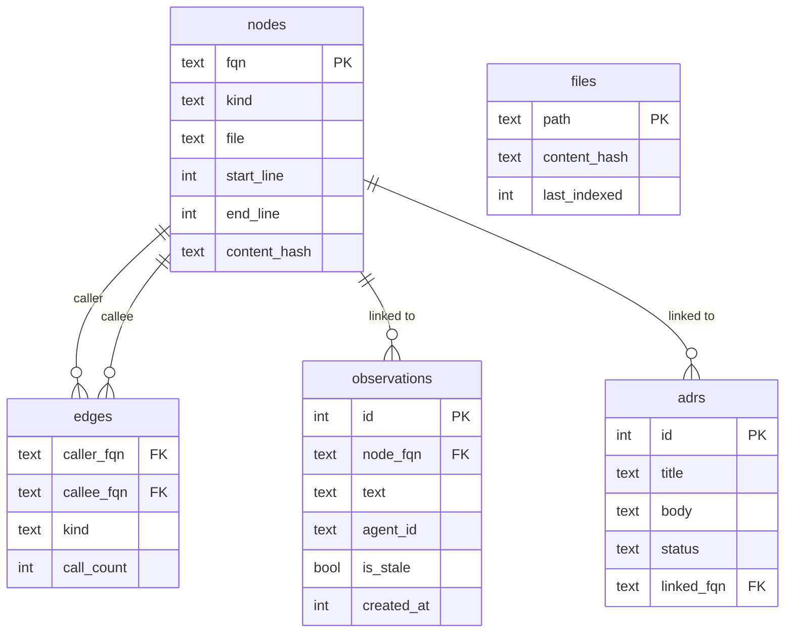
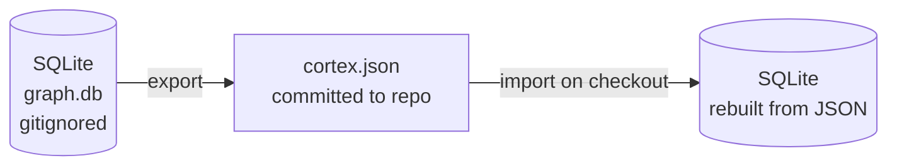

# Architecture

Cortex is a single Rust binary that runs three subsystems in one process.

## Overview

## Indexer

The indexer walks the repository, parses each file with tree-sitter, and extracts:

- Symbols (functions, classes, methods, modules, interfaces, enums)
- Call edges (function A calls function B)
- Import relationships
- HTTP route definitions
- Taint sources and sinks

Parsing is parallelized with Rayon. Each file gets its own tree-sitter parser instance. Results are written to SQLite serially (single writer constraint).

On subsequent runs, the indexer skips files whose content hash has not changed. A full re-index of a medium project (100 files, 30K lines) takes about 500ms. Incremental re-index with no changes takes under 15ms.

## File watcher

When running in `serve` mode, Cortex starts a file watcher using the `notify` crate. It uses native OS file system events (inotify on Linux, FSEvents on macOS, ReadDirectoryChangesW on Windows).

When a file changes, the watcher triggers a re-index of just that file. The graph stays current without manual intervention.

## MCP server

The MCP server runs on a Tokio async runtime. It communicates over stdio using JSON-RPC 2.0, the standard MCP transport.

Each tool call is handled concurrently (up to 4 simultaneous calls by default). Read operations use a connection pool. Write operations go through a single writer connection.

## Database schema

Cortex uses SQLite in WAL mode with a configurable read pool (1-16 connections, default 4).

Core tables:

- `nodes`: all extracted symbols (FQN, kind, file, line, column, content hash, coverage data)
- `edges`: call relationships between nodes (caller FQN, callee FQN, kind, call count)
- `files`: tracked files with content hashes for change detection
- `observations`: agent memory linked to node FQNs with timestamps and staleness
- `adrs`: architectural decision records
- `fts_nodes`: FTS5 virtual table for full-text search over symbol names

Indexes exist on FQN, file path, and edge endpoints for fast lookups.

## Coverage field

When LCOV coverage data is loaded via `cortex coverage --lcov`, each graph node gains a structured `coverage` field:

| Field | Type | Description |
|-------|------|-------------|
| `hit_count` | u32 | Number of test executions hitting this function |
| `line_coverage_pct` | f64 | Percentage of lines covered (0.0 to 100.0) |
| `is_covered` | bool | Whether the function has any coverage (`hit_count > 0`) |

Nodes without coverage data have `coverage: null`. The `get_file_context` and `search_symbols` MCP tools include coverage when it has been loaded.

## NodeKind classification

The indexer assigns `NodeKind::Method` to functions defined inside a class, struct, impl block, or trait implementation. Standalone functions get `NodeKind::Function`. The classification rules per language:

| Language | Method context |
|----------|---------------|
| Python | Function inside `class_definition` |
| TypeScript | Function inside `class_declaration` or `class_body` |
| Rust | Function inside `impl_item` or `trait_item` |
| Go | Function with receiver parameter |
| Java | Function inside `class_declaration` or `interface_declaration` |

Methods include the parent type name in their FQN: `file::ClassName::method_name`. Standalone functions use `file::function_name`.

## Ego-graph capping

Ego-graph queries (subgraph centered on a node) are capped at 500 nodes. When the traversal would exceed this limit, nodes are prioritized by:

1. BFS depth (closer nodes first)
2. Caller count within the same depth (more-connected nodes first)

The response includes `truncated: true` and `total_reachable` count so consumers know the full extent of the subgraph.

## Language support

Cortex uses tree-sitter grammars compiled into the binary. No external grammar files needed.

Supported languages (29, of which 26 use tree-sitter grammars and 3 use regex-based extraction: Kotlin, SQL, Perl):

| Language | Extensions |
|----------|-----------|
| Python | .py |
| TypeScript | .ts |
| TSX/JSX | .tsx, .jsx |
| JavaScript | .js, .jsx, .mjs |
| Go | .go |
| Rust | .rs |
| Java | .java |
| C# | .cs |
| C++ | .cpp, .cc, .cxx, .hpp, .h |
| C | .c |
| Ruby | .rb |
| Scala | .scala |
| Swift | .swift |
| PHP | .php |
| SQL | .sql |
| Kotlin | .kt, .kts |
| Dart | .dart |
| Elixir | .ex, .exs |
| Haskell | .hs |
| Lua | .lua |
| Zig | .zig |
| Bash/Shell | .sh, .bash |
| Perl | .pl, .pm |
| R | .r, .R |
| Objective-C | .m |
| OCaml | .ml, .mli |
| Julia | .jl |
| YAML | .yml, .yaml |
| Terraform/HCL | .tf, .hcl |

Each language has a tree-sitter query that extracts function definitions, class definitions, method definitions, and call expressions. Python, TypeScript, Rust, and Go have the most complete coverage.

## Security analysis

The security pass runs over the AST and call graph during indexing:

- Taint source/sink detection (HTTP inputs, SQL queries, file writes, command execution)
- Inter-procedural taint propagation via call graph edges
- OWASP Top 10 pattern matching against the structural graph
- SBOM generation from the import graph (SPDX format)
- Dependency vulnerability checking via OSV.dev

## Semantic search

When enabled (`cortex semantic enable`), Cortex downloads a local ONNX model (nomic-embed-text-v1, about 138 MB) and generates embeddings for all symbols. These are stored in the SQLite database via sqlite-vec and used for vector similarity search.

The model runs locally with no network calls after the initial download. Suitable for air-gapped environments.

## Bundle format

The `cortex bundle export` command produces a JSON file containing all nodes, edges, and observations. This file can be committed to the repository so teammates can query the graph without re-indexing.

The bundle is JSON (not SQLite) because:
- JSON is diffable in pull requests
- Adding fields is backward-compatible
- Developers can open cortex.json and read the observations their team's agents wrote

## Memory layer

Agent observations are stored linked to specific code node FQNs. When the indexer detects that a node has changed (content hash differs), all observations linked to that node are marked stale.

Stale observations still surface in read results, but with a clear `is_stale: true` flag so the agent knows the note may be outdated.

## Agent steering generation

The `generate_steering` tool produces markdown content for CLAUDE.md, AGENTS.md, or .cursorrules files. The generated content includes:

- **Module boundaries**: derived from Leiden community detection, showing clusters of tightly-coupled code
- **Complexity hotspots**: top functions by cyclomatic complexity with file paths
- **Active ADRs**: architectural decision records with status "accepted"

The output is kept under 2000 tokens (estimated as character count / 4). If the content exceeds this budget, hotspots are truncated to the top 5 and ADR summaries are reduced to title-only.

## Unified UI

When the visualizer HTTP server is enabled (`CORTEX_UI_ENABLED=true` or `cortex viz --port`), Cortex serves a tabbed interface at the root path:

- **Graph tab**: interactive 3D force-graph visualization of the call graph
- **Dashboard tab**: metrics overview with node counts, language distribution, and coverage summary
- **Explorer tab**: symbol search and navigation with filtering by kind

The UI uses Lucide icons, a responsive CSS grid layout (768px to 2560px), and the project design tokens (off-white background, off-black text, Press Start 2P brand font).
