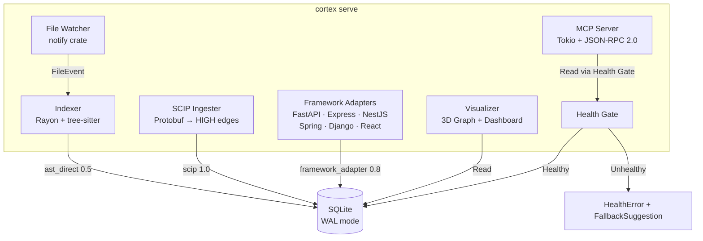
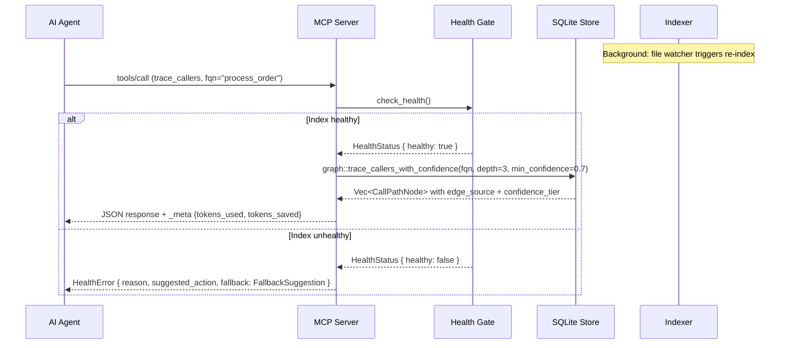
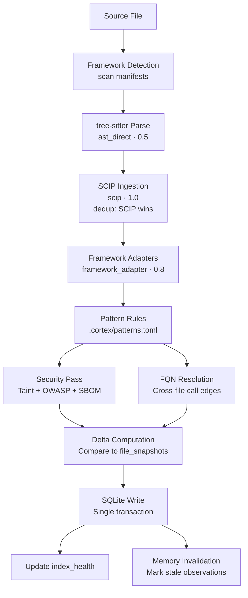
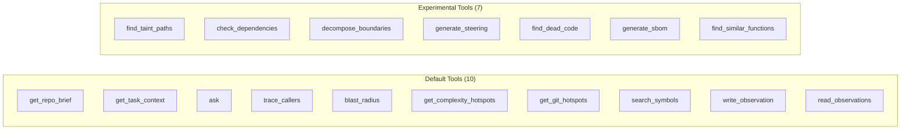
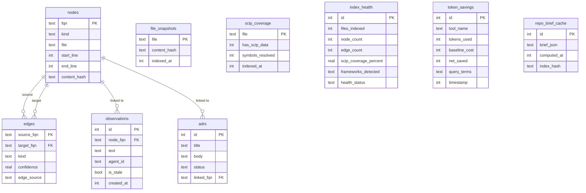
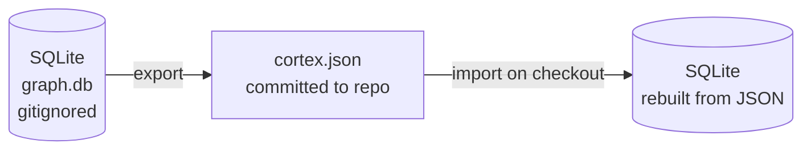

# Architecture

Cortex is a single Rust binary that runs three subsystems in one process.

## Overview





## Indexer pipeline

The indexer runs in multiple passes per file:

1. **Framework detection** — scans dependency manifests to determine which adapters to activate
2. **tree-sitter parse** — extracts symbols and call edges (`edge_source=ast_direct`, `confidence=0.5`)
3. **SCIP ingestion** — additive pass that reads `.scip/index.scip` (or `index.scip`, `dump.lsif`) and creates HIGH-confidence edges (`edge_source=scip`, `confidence=1.0`); SCIP edges win over tree-sitter on conflicts
4. **Framework adapters** — pattern-match framework-specific wiring (DI, routing, middleware) and create MEDIUM-confidence edges (`edge_source=framework_adapter`, `confidence=0.8`)
5. **Pattern rules** — user-defined regex rules from `.cortex/patterns.toml`
6. **Embeddings** — incremental embedding generation (only re-embeds functions whose content hash changed)
7. **Health update** — writes `index_health` singleton row with file/node/edge counts and SCIP coverage



On subsequent runs, the indexer skips files whose content hash has not changed. A full re-index of a medium project (100 files, 30K lines) takes about 500ms. Incremental re-index with no changes takes under 15ms.

## Confidence system

Every edge in the graph carries a `edge_source` and `confidence` value. Queries default to `confidence >= 0.7` (MEDIUM), filtering out heuristic name-match edges.

| Source | Confidence | Tier | How produced |
|--------|-----------|------|--------------|
| `scip` | 1.0 | HIGH | SCIP index (precise symbol resolution) |
| `framework_adapter` | 0.8 | MEDIUM | FastAPI/Express/NestJS/Spring/Django/React pattern matching |
| `ast_direct` | 0.5 | LOW | tree-sitter AST extraction |
| `name_match` | 0.3 | VERY_LOW | heuristic name-based resolution |

The `min_confidence` parameter on `trace_callers` and `blast_radius` lets agents lower or raise the threshold. All MCP tool responses include `edge_source` and `confidence_tier` per result.

## Framework adapters

Six adapters detect wiring that tree-sitter cannot see:

| Adapter | Patterns detected | Edge kinds |
|---------|------------------|-----------|
| FastAPI | `Depends(X)`, `@app.get/post`, `@router.*` | `Injects`, `Routes` |
| Express | `app.use(mw)`, `router.use(mw)`, `router.get/post/put/delete` | `Middleware`, `Routes` |
| NestJS | `@Controller()`, `@Injectable()` constructor injection | `Routes`, `Injects` |
| Spring | `@Autowired`, `@Inject`, `@Component/@Service/@Repository`, `@Bean` | `Injects` |
| Django | `urlpatterns path()/re_path()`, `@login_required` | `Routes`, `Middleware` |
| React | JSX component renders, `useContext(SomeContext)` | `Renders`, `Injects` |

Adapters only run for frameworks detected in dependency manifests. Manual override via `.cortex/config.toml` `frameworks = ["fastapi", "express"]`.

## Index health gate

All MCP tools check `index_health` before serving results. If `files_indexed == 0` or `node_count == 0` or `edge_count == 0`, every tool returns a `HealthError` with:
- `reason`: specific failure description
- `suggested_action`: e.g. "Run `cortex index`"
- `fallback`: `FallbackSuggestion` with grep commands and file-read suggestions

`cortex_status` and `get_repo_brief` are exempt from the health gate and always respond.

## Evidence-fusion ranking

`get_task_context` uses a multi-signal ranking formula:

```
score = (lexical_match × 0.30)
      + (embedding_similarity × 0.25)   ← 0.0 if embeddings unavailable
      + (scip_reference_distance × 0.20)
      + (git_recency × 0.15)
      + (edge_confidence × 0.10)
      + (file_size_penalty × −0.05)
```

When embeddings are unavailable, `lexical_match` weight becomes 0.55. Results are packed greedily into the token budget; top-1 is always included. Each result includes a one-line reason explaining why it was selected.

## File watcher

When running in `serve` mode, Cortex starts a file watcher using the `notify` crate. It uses native OS file system events (inotify on Linux, FSEvents on macOS, ReadDirectoryChangesW on Windows).

When a file changes, the watcher triggers a re-index of just that file. The graph stays current without manual intervention.

## MCP server

The MCP server runs on a Tokio async runtime. It communicates over stdio using JSON-RPC 2.0, the standard MCP transport.

Each tool call is handled concurrently (up to 4 simultaneous calls by default). Read operations use a connection pool. Write operations go through a single writer connection.

### Tool surface

Tools are classified into three tiers:

| Tier | Count | How to enable |
|------|-------|---------------|
| Default (always-on) | 10 | automatic |
| Experimental (opt-in) | 7 | `.cortex/config.toml` `experimental_tools = true` |
| Smart-tools mode | 5 | `cortex serve --smart-tools` |

`semantic_search` only appears in the manifest when embeddings are built.



## Database schema

Cortex uses SQLite in WAL mode with a configurable read pool (1–16 connections, default 4).



Core tables:

- `nodes`: all extracted symbols (FQN, kind, file, line, content hash)
- `edges`: relationships between nodes — now includes `edge_source` and `confidence`
- `file_snapshots`: tracked files with content hashes for change detection
- `scip_coverage`: per-file SCIP coverage tracking
- `index_health`: singleton row updated after every index run
- `observations`: agent memory linked to node FQNs with staleness tracking
- `adrs`: architectural decision records
- `token_savings`: per-query savings with honest `net_saved` (can be negative)
- `repo_brief_cache`: cached `get_repo_brief` output, invalidated on re-index
- `nodes_fts`: FTS5 virtual table for full-text search over symbol names

Schema migrations are numbered SQL files applied in order on startup (0001–0012).

## NodeKind classification

The indexer assigns `NodeKind::Method` to functions defined inside a class, struct, impl block, or trait implementation. Standalone functions get `NodeKind::Function`. The classification rules per language:

| Language | Method context |
|----------|---------------|
| Python | Function inside `class_definition` |
| TypeScript | Function inside `class_declaration` or `class_body` |
| Rust | Function inside `impl_item` or `trait_item` |
| Go | Function with receiver parameter |
| Java | Function inside `class_declaration` or `interface_declaration` |

Methods include the parent type name in their FQN: `file::ClassName::method_name`. Standalone functions use `file::function_name`.

## Language support

Cortex uses tree-sitter grammars compiled into the binary. No external grammar files needed.

Supported languages (29, of which 26 use tree-sitter grammars and 3 use regex-based extraction: Kotlin, SQL, Perl):

| Language | Extensions |
|----------|-----------|
| Python | .py |
| TypeScript | .ts |
| TSX/JSX | .tsx, .jsx |
| JavaScript | .js, .jsx, .mjs |
| Go | .go |
| Rust | .rs |
| Java | .java |
| C# | .cs |
| C++ | .cpp, .cc, .cxx, .hpp, .h |
| C | .c |
| Ruby | .rb |
| Scala | .scala |
| Swift | .swift |
| PHP | .php |
| SQL | .sql |
| Kotlin | .kt, .kts |
| Dart | .dart |
| Elixir | .ex, .exs |
| Haskell | .hs |
| Lua | .lua |
| Zig | .zig |
| Bash/Shell | .sh, .bash |
| Perl | .pl, .pm |
| R | .r, .R |
| Objective-C | .m |
| OCaml | .ml, .mli |
| Julia | .jl |
| YAML | .yml, .yaml |
| Terraform/HCL | .tf, .hcl |

## Security analysis

The security pass runs over the AST and call graph during indexing:

- Taint source/sink detection (HTTP inputs, SQL queries, file writes, command execution)
- Inter-procedural taint propagation via call graph edges
- OWASP Top 10 pattern matching against the structural graph
- SBOM generation from the import graph (SPDX format)
- Dependency vulnerability checking via OSV.dev

## Semantic search

When enabled (`cortex semantic enable`), Cortex downloads a local ONNX model (nomic-embed-text-v1, about 138 MB) or uses Ollama with `nomic-embed-code` if available. Embeddings are generated for all Function/Method/Class nodes and stored in the SQLite database via sqlite-vec.

Embedding generation is **incremental**: only nodes whose content hash changed since the last run are re-embedded. Stale embeddings for deleted nodes are removed automatically.

When embeddings are available, `get_task_context` uses cosine similarity as a 0.25-weight signal in evidence-fusion ranking. `cortex status` shows the embedding count and a degradation warning when running in BM25-only mode.

The `semantic_search` MCP tool only appears in the tool manifest when embeddings are built.

## Token savings accounting

After every query, Cortex records:

- `baseline_cost = (matching_file_count × avg_file_tokens) + grep_output_tokens`
- `net_saved = baseline_cost − (cortex_response_tokens + query_overhead_tokens)`

Negative values (Cortex cost more than grep would have) are stored and reported without modification. `cortex status --savings` shows the full dashboard.

## Bundle format

The `cortex bundle export` command produces a JSON file containing all nodes, edges, and observations. This file can be committed to the repository so teammates can query the graph without re-indexing.



## Memory layer

Agent observations are stored linked to specific code node FQNs. When the indexer detects that a node has changed (content hash differs), all observations linked to that node are marked stale.

Stale observations still surface in read results, but with a clear `is_stale: true` flag so the agent knows the note may be outdated.

## Correctness benchmarks

`cortex benchmark` runs JSON-based test suites with ground-truth answers for `trace_callers`, `blast_radius`, `get_task_context`, and `ask`. The CI pipeline runs this on every release and fails the build if pass rate drops below 70%. `cortex status` displays a warning when the last benchmark run was below threshold.
